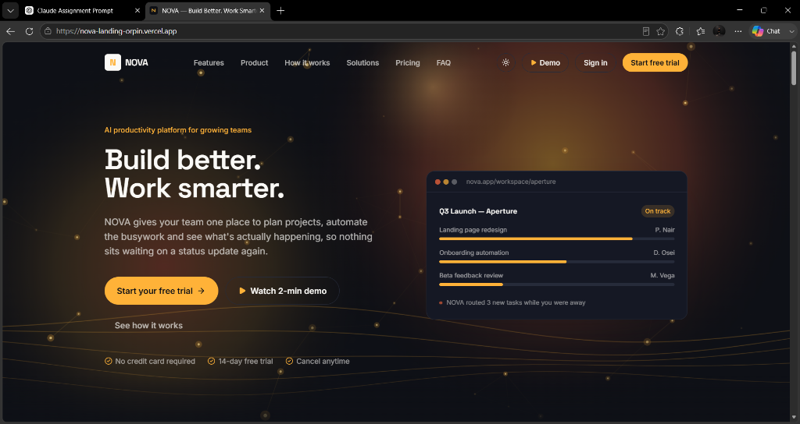
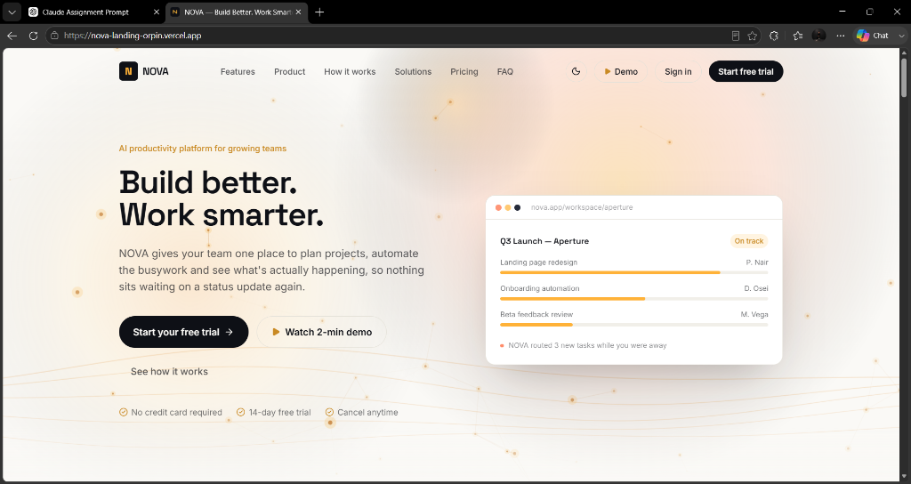
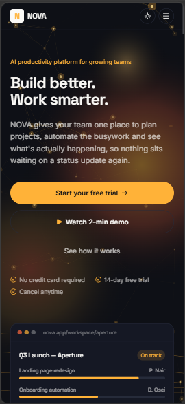
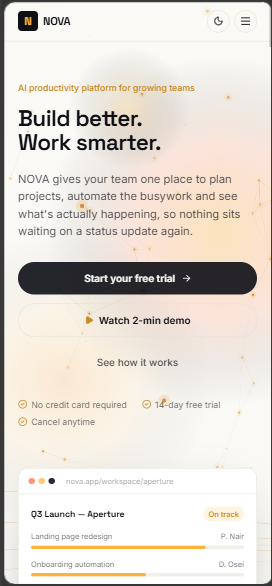

# NOVA — AI Productivity Platform Landing Page

[](https://nova-landing-orpin.vercel.app/)
[](https://github.com/nishantsahu258-afk/nova-landing)
[](https://react.dev/)
[](https://tailwindcss.com/)
[](https://vitejs.dev/)

A responsive landing page for **NOVA**, a fictional AI productivity platform, created for the Front-End Development Intern Assignment.

- **Live Demo:** [https://nova-landing-orpin.vercel.app/](https://nova-landing-orpin.vercel.app/)
- **GitHub Repository:** [https://github.com/nishantsahu258-afk/nova-landing](https://github.com/nishantsahu258-afk/nova-landing)

---

## Table of Contents

- [Project Description](#project-description)
- [Technologies Used](#technologies-used)
- [Features](#features)
- [Screenshots](#screenshots)
- [Installation Instructions](#installation-instructions)
- [Deployment](#deployment)
- [Component Architecture](#component-architecture)
- [Design Decisions](#design-decisions)
- [Challenges Faced & Solutions](#challenges-faced--solutions)
- [AI Tools Used](#ai-tools-used)

---

## Project Description

**NOVA** is a concept AI productivity platform with the tagline **"Build Better. Work Smarter."** The landing page communicates how the platform automates task routing, synchronizes team timelines, and surfaces cross-functional updates without requiring manual status meetings.

The page is built as a single-page marketing site inspired by modern developer tool interfaces. It features clear typographic hierarchy, purposeful dark and light color themes, a structured component layout, and interactive UI states across desktop and mobile screens.

---

## Technologies Used

- **React 19** — Component structure and hooks (`useState`, `useEffect`, `useRef`, `useContext`) for state and DOM lifecycle handling.
- **Vite 8** — Fast local development server and optimized Rollup production builds.
- **Tailwind CSS 3** — Utility-first styling with class-based dark mode (`darkMode: 'class'`) and consistent spacing/color tokens.
- **lucide-react** — Crisp vector icons for UI actions, features, and status badges.
- **HTML5 Canvas API** — Ambient wave and particle background in the Hero section, rendered natively without heavy 3D libraries.
- **oxlint** — Lightweight JavaScript/React linter for code health and hook rule checks.

---

## Features

### All 13 Required Sections

1. **Navigation Bar:** Fixed header with scroll blur, brand logo, in-page navigation anchors, theme toggle button, and mobile hamburger drawer.
2. **Hero Section:** Value proposition headline, subhead, CTA buttons ("Start your free trial", "Watch 2-min demo"), trust indicators, interactive dashboard preview card, and canvas background.
3. **Trusted By / Social Proof:** Infinite marquee displaying partner brand names with bespoke SVG emblems (*Aperture, Northwind, Kestrel, Fieldstone, Marbletree, Loom & Co*).
4. **Features (6 Key Features):** Hairline grid detailing automated task routing, live dependencies, AI transcription, status briefs, shared workspaces, and team automations.
5. **Product / About Section:** Explains platform workflow synchronization alongside live system stats.
6. **How It Works (4 Steps):** Step-by-step onboarding walkthrough with numeric badges and a visual connecting guide.
7. **Statistics:** Key metrics with animated count-up numbers triggered when scrolled into view.
8. **Solutions / Use Cases:** Targeted breakdowns for Product, Engineering, Marketing, and Operations teams.
9. **Testimonials:** Customer quote carousel featuring auto-rotation, pause-on-hover, manual next/previous navigation, and progress dot indicators.
10. **Pricing:** Three tier options (Starter, Growth, Scale) with a monthly/annual billing switch that dynamically recalculates prices.
11. **FAQ:** Accordion component allowing one open item at a time with smooth expand/collapse transitions.
12. **Final Call to Action:** High-contrast conversion banner encouraging free trial signups.
13. **Footer:** Structured link columns (Product, Company, Resources, Legal), copyright notice, and a newsletter subscription form with client-side email validation.

### Implemented Interactions & Enhancements

- **Dark & Light Mode:** Theme toggle persisted to `localStorage` and defaulted to system preference (`prefers-color-scheme`).
- **Interactive Demo Modal:** 3-tab platform simulator (Task Routing, Live Dependency Timelines, AI Call Transcripts) with playback controls and keyboard `Escape` dismissal.
- **Mobile Navigation Drawer:** Responsive slide-down menu that automatically closes upon selecting any section link.
- **Count-up Animation:** Custom easing counter powered by `IntersectionObserver` and `requestAnimationFrame`.
- **Newsletter Validation:** Client-side email validation with immediate inline feedback states.
- **Scroll-to-Top Button:** Floating back-to-top button that appears after scrolling past the hero fold.
- **Accessibility:** Skip-to-content bypass link (`#main-content`), semantic HTML elements, ARIA attributes (`aria-expanded`, `aria-controls`, `role="switch"`), and `:focus-visible` ring styling.

---

## Screenshots

### Desktop Views

| Dark Mode (Default) | Light Mode |
| :---: | :---: |
| <br>*(Hero section with ambient canvas, dark theme palette, and dashboard preview)* | <br>*(Light theme palette with warm paper background and high-contrast typography)* |

### Mobile Views (Responsive)

| Dark Mode (Mobile) | Light Mode (Mobile) |
| :---: | :---: |
| <br>*(Responsive mobile layout, dark mode header, and hero stack)* | <br>*(Responsive mobile layout, light mode header, and hero stack)* |

> *Tip: You can test all themes, layouts, and interactive components directly on the [Live Demo](https://nova-landing-orpin.vercel.app/).*

---

## Installation Instructions

Follow these steps to run the project locally:

```bash
# 1. Clone the repository
git clone https://github.com/nishantsahu258-afk/nova-landing.git

# 2. Navigate to the project directory
cd nova-landing

# 3. Install dependencies
npm install

# 4. Start the development server
npm run dev

# 5. Open http://localhost:5173 in your browser
```

### Additional Scripts

```bash
# Run code linting
npm run lint

# Build production bundle
npm run build

# Preview production build locally
npm run preview
```

---

## Deployment

The project is deployed on **Vercel** with continuous deployment linked to the `main` branch.

- **Production URL:** [https://nova-landing-orpin.vercel.app/](https://nova-landing-orpin.vercel.app/)
- **Build Output:** ~78 kB gzip JS and ~7 kB gzip CSS bundle.

---

## Component Architecture

The codebase separates presentation components, static content, and theme state into modular files:

```
src/
├── App.jsx                   # Layout container, skip-to-content link, and modal mount
├── main.jsx                  # React DOM entry point wrapped in ThemeProvider
├── index.css                 # Tailwind directives, custom font imports, and utilities
├── context/
│   └── ThemeContext.jsx      # Theme state provider (light/dark) with localStorage sync
├── data/
│   └── content.js            # Content repository (nav, features, pricing, FAQ, testimonials)
└── components/
    ├── Navbar.jsx             # Sticky navigation bar and mobile drawer
    ├── Hero.jsx               # Headline, action buttons, and product mockup card
    ├── HeroBackground.jsx     # Canvas animation (perspective waves and constellation field)
    ├── TrustedBy.jsx          # Partner brand marquee with bespoke SVG emblems
    ├── Features.jsx           # 6-card feature grid
    ├── Product.jsx            # Platform synchronization overview and stats grid
    ├── HowItWorks.jsx         # 4-stage onboarding sequence
    ├── Stats.jsx              # Intersection-observed count-up statistics
    ├── Solutions.jsx          # Role-based use cases (Product, Eng, Marketing, Ops)
    ├── Testimonials.jsx       # Carousel with auto-advance and manual controls
    ├── Pricing.jsx            # 3 pricing tiers with monthly/annual toggle
    ├── FAQ.jsx                # Single-expand accordion with CSS grid transitions
    ├── FinalCTA.jsx           # Closing call-to-action banner
    ├── Footer.jsx             # Site links, legal links, and validated newsletter form
    ├── BackToTop.jsx          # Scroll-to-top button
    └── DemoModal.jsx          # 3-tab simulated platform demo dialog
```

---

## Design Decisions

- **Typography:** **Space Grotesk** is used for headings to give a technical, structured feel, while **Inter** is used for body text to maintain legibility across various screen sizes.
- **Color System:**
  - `ink` (`#0E1016`): Deep neutral used for dark backgrounds and high-contrast light mode text.
  - `paper` (`#FAF9F6`): Off-white tone for light mode to avoid harsh pure-white glare.
  - `signal` (`#FFB238`): Warm amber accent reserved for key action buttons, active tags, and badges.
  - `ember` (`#FF6A3D`): Secondary warm accent for notification highlights and gradients.
- **Visual Structure:** The layout alternates between different presentation formats (hairline grids, split views, highlighted cards) so sections remain distinct as the user scrolls.

---

## Challenges Faced & Solutions

1. **Accordion Height Animation Without Fixed Heights**
   - *Challenge:* Animating an accordion between closed and open states without hardcoding pixel heights often results in abrupt layout jumps.
   - *Solution:* Implemented CSS Grid using `grid-template-rows: 0fr` transitioning to `grid-template-rows: 1fr` on the content wrapper, producing a smooth height transition while allowing dynamic content height.

2. **Pricing Switch Toggle Alignment**
   - *Challenge:* Absolute positioning with arbitrary pixel offsets caused the toggle indicator dot to bleed outside its container on certain viewports.
   - *Solution:* Rebuilt the switch with an explicit container (`h-7 w-12 shrink-0 p-1`) and standard Tailwind translation classes (`translate-x-0` to `translate-x-5`), ensuring consistent containment across all screen sizes.

3. **Ambient Hero Animation Performance**
   - *Challenge:* Creating visual depth in the hero section without loading heavy 3D libraries or video files that hurt initial load time.
   - *Solution:* Wrote a lightweight HTML5 Canvas component with sine-wave perspective math and integrated an `IntersectionObserver` to pause the rendering loop whenever the hero section leaves the viewport.

---

## AI Tools Used

- **Tools Consulted:** ChatGPT / Claude / Gemini
- **Role in Development:**
  - AI tools were used for development assistance, such as brainstorming realistic copy for the fictional NOVA brand, checking email regex patterns, and reviewing WCAG accessibility recommendations.
  - AI was also used to explore mathematical easing formulas for the count-up stats animation.
- **Code Ownership & Understanding:**
  - All architecture decisions, component implementations, state handling, styling, and final integrations were written, reviewed, and tested by me.
  - I understand every file in this repository and can explain or modify any component during technical review.
